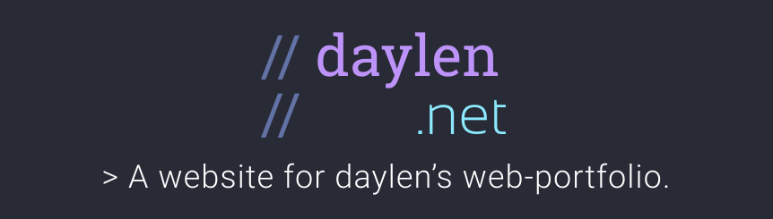

<p align="center">
  <a href="https://daylen.net">
    
  </a>
</p>

<p align="center">
  <a href="https://app.netlify.com/sites/gatsby-starter-netlify-cms-ci/deploys">
    
  </a>
  <a href="https://github.com/prettier/prettier">
    
  </a>
<p align="center">
  <a href="https://daylen.net">
    <strong>Website Link</strong>
  </a>
</p>


</p>


<p align="center">
  <em>Note</em>: This repo is based upon the 
  <a href="https://github.com/netlify-templates/gatsby-starter-netlify-cms">Netlify CMS and Gatsby Starter</a>. <br/>
  Do you have suggestions or feedback?<a href="https://github.com/daylennguyen/RerunDaylennet/issues/new"> Open an issue</a>
</p>
  
## Features
- [X] [🕶 `Gatsby v2` for Static page generation](https://github.com/gatsbyjs/gatsby/projects/2) 
- [X] [🕶 `gatsby-plugin-purgecss` for Stylesheet overhead reduction](https://www.gatsbyjs.org/packages/gatsby-plugin-purgecss/)
- [X] [🍌 `bulma` CSS baseline && Bulma builds are usually ~170K but reduced 90% by purgecss.](https://bulma.io/). 
- [] `🤩 Page Transitions`, component-based (with no-js support)
- [] 👮‍♂️ `IntersectionObserver`, component-based (with polyfill)
  
  
## Prerequisites

- Node (I recommend using v8.2.0 or higher)
- [Gatsby CLI](https://www.gatsbyjs.org/docs/)

### Access Locally
```
$ git clone https://github.com/[GITHUB_USERNAME]/[REPO_NAME].git
$ cd [REPO_NAME]
$ yarn
$ npm run develop
```
To test the CMS locally, you'll need run a production build of the site:
```
$ npm run build
$ npm run serve
```

### Setting up the CMS
Follow the [Netlify CMS Quick Start Guide](https://www.netlifycms.org/docs/quick-start/#authentication) to set up authentication, and hosting.

